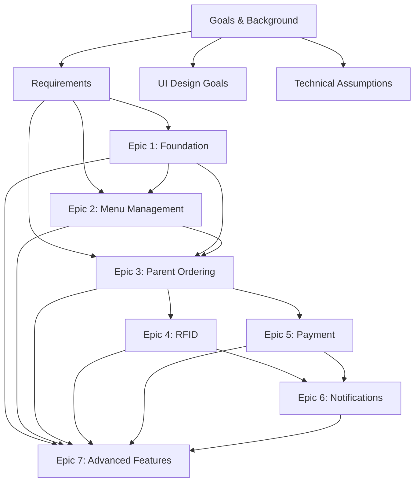

# HASIVU Platform Documentation

## Overview

This directory contains comprehensive documentation for the HASIVU Platform, an RFID-integrated e-commerce platform for school food services. The documentation is organized for different audiences and development phases.

## 📋 Product Requirements (PRD)

**Status**: ✅ **Sharded and Ready**

The Product Requirements Documentation has been sharded into focused, maintainable documents:

- **[PRD Overview](prd/README.md)** - Navigation and document structure guide
- **[Foundation Documents](prd/)** - Goals, requirements, design, and technical specifications
- **[Epic Documentation](prd/epics/)** - Detailed feature specifications and implementation guides
- **[Process Workflows](prd/workflows/)** - Team procedures and quality validation

### Quick Start by Role

| Role                   | Start Here                                               | Key Documents                        |
| ---------------------- | -------------------------------------------------------- | ------------------------------------ |
| **Product Manager**    | [Goals & Background](prd/01-goals-background.md)         | All foundation docs + Epic overviews |
| **Tech Lead**          | [Technical Assumptions](prd/04-technical-assumptions.md) | Technical specs + Epic 1             |
| **Frontend Developer** | [UI Design Goals](prd/03-ui-design-goals.md)             | Epic 3 (Parent Experience)           |
| **Backend Developer**  | [Requirements](prd/02-requirements.md)                   | Epic 1 (Foundation) + Epic 4/5       |
| **UX Designer**        | [UI Design Goals](prd/03-ui-design-goals.md)             | Epic 3 + Accessibility requirements  |
| **QA Engineer**        | [Requirements](prd/02-requirements.md)                   | Quality validation checklist         |

## 🏗️ Architecture Documentation

- **[Technical Architecture](architecture.md)** - System architecture and design decisions
- **[Frontend Specification](front-end-spec.md)** - Frontend architecture and patterns
- **[Infrastructure Setup](iac-setup-story.md)** - Infrastructure as Code implementation

## 📖 Project Documentation

### Project Brief and Scope

- **[Project Brief](brief.md)** - Original project definition and scope
- **[MVP Scope Refinement](mvp-scope-refinement.md)** - Refined MVP requirements

### Enhancement Documents

- **[Monitoring Strategy](enhanced-monitoring-strategy.md)** - Comprehensive monitoring approach
- **[Testing Infrastructure](testing-infrastructure-enhancement.md)** - Testing strategy and tools
- **[Technical Debt Management](technical-debt-management.md)** - Technical debt strategy

### External Integrations

- **[External Service Setup](external-service-setup-epic.md)** - Third-party service integration

## 📚 Detailed Stories

The **[stories/](stories/)** directory contains detailed implementation guides for individual user stories:

### Epic 1: Foundation

- [1.1 Project Setup & Infrastructure](stories/1.1.project-setup-infrastructure.md)
- [1.2 User Authentication & Authorization](stories/1.2.user-authentication-authorization.md)
- [1.3 Core User Management](stories/1.3.core-user-management.md)
- [1.4 API Gateway & Service Foundation](stories/1.4.api-gateway-service-foundation.md)

### Epic 2: Menu Management

- [2.1 Product Catalog Foundation](stories/2.1.product-catalog-foundation.md)
- [2.2 Menu Planning & Scheduling](stories/2.2.menu-planning-scheduling.md)
- [2.3 Nutritional Information Management](stories/2.3.nutritional-information-management.md)

### Epic 3: Parent Ordering

- [3.1 Menu Discovery & Browsing](stories/3.1.menu-discovery-browsing.md)
- [3.2 Shopping Cart & Order Management](stories/3.2.shopping-cart-order-management.md)
- [3.3 Saved Preferences & Quick Reordering](stories/3.3.saved-preferences-quick-reordering.md)
- [3.4 Order Review & Checkout](stories/3.4.order-review-checkout.md)

### Epic 4: RFID Verification

- [4.1 RFID Hardware Integration](stories/4.1.rfid-hardware-integration-foundation.md)
- [4.2 Student RFID Card Management](stories/4.2.student-rfid-card-management.md)
- [4.3 Real-time Delivery Verification](stories/4.3.real-time-delivery-verification.md)
- [4.4 Order Tracking & Status Management](stories/4.4.order-tracking-status-management.md)

### Epic 5: Payment Processing

- [5.1 Payment Gateway Integration](stories/5.1.payment-gateway-integration.md)
- [5.2 Billing & Invoice Management](stories/5.2.billing-invoice-management.md)
- [5.3 Subscription & Recurring Payments](stories/5.3.subscription-recurring-payments.md)

### Epic 6: Notifications

- [6.1 Notification Infrastructure](stories/6.1.notification-infrastructure.md)
- [6.2 WhatsApp Business API Integration](stories/6.2.whatsapp-business-api-integration.md)
- [6.3 In-App Notification System](stories/6.3.in-app-notification-system.md)

### Epic 7: Advanced Features

- [7.1 Analytics Dashboard & Reporting](stories/7.1.analytics-dashboard-reporting.md)

## 🔄 Documentation Maintenance

### Document Relationships

### Update Procedures

1. **Foundation Changes**: Update foundation documents → notify all teams → update dependent epics
2. **Epic Changes**: Update epic documents → update related stories → notify affected teams
3. **Story Changes**: Update story documents → verify epic consistency
4. **Cross-Document**: Use cross-references to maintain consistency

### Ownership and Reviews

| Document Type         | Primary Owner               | Review Frequency     |
| --------------------- | --------------------------- | -------------------- |
| Goals & Background    | Product Manager             | Quarterly            |
| Requirements          | Product Manager + Tech Lead | Sprint Planning      |
| UI Design Goals       | UX Lead                     | Design Reviews       |
| Technical Assumptions | Tech Lead                   | Architecture Reviews |
| Epic Documents        | Epic Owner                  | Sprint Planning      |
| Story Documents       | Feature Lead                | Story Grooming       |

## 🚀 Getting Started

### For New Team Members

1. **Read**: [Project Brief](brief.md) for context
2. **Review**: [Goals & Background](prd/01-goals-background.md) for business objectives
3. **Understand**: [Requirements](prd/02-requirements.md) for functional specifications
4. **Study**: Role-specific documents (see Quick Start table above)

### For Development Teams

1. **Architecture**: Start with [Technical Assumptions](prd/04-technical-assumptions.md)
2. **Epic Planning**: Review [Epic Overview](prd/epics/README.md)
3. **Implementation**: Use detailed story documents for development
4. **Quality**: Follow [Quality Validation](prd/workflows/checklist-validation.md)

### For Stakeholders

1. **Business Case**: [Goals & Background](prd/01-goals-background.md)
2. **User Experience**: [UI Design Goals](prd/03-ui-design-goals.md)
3. **Timeline**: [Epic Overview](prd/epics/README.md)
4. **Progress**: Epic-specific documents for status updates

## 📊 Documentation Metrics

- **Total Documents**: 45+ documents across all categories
- **Foundation Documents**: 4 core documents (✅ Complete)
- **Epic Documents**: 7 epic specifications (3 complete, 4 in progress)
- **Story Documents**: 20+ detailed implementation guides
- **Process Documents**: Quality validation and team procedures

## 🔗 External Resources

- **Original PRD**: [prd.md](prd.md) (Legacy monolithic version - reference only)
- **Project Repository**: Link to main codebase (when available)
- **Design System**: Link to design system documentation (when available)
- **API Documentation**: Link to API documentation (when available)

---

**Last Updated**: August 3, 2025  
**Maintained By**: Product Management Team  
**Documentation Structure**: Sharded PRD with cross-references  
**Status**: Ready for Team Handoff
