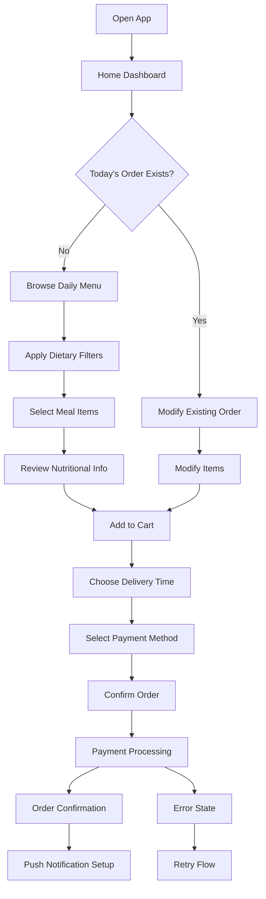
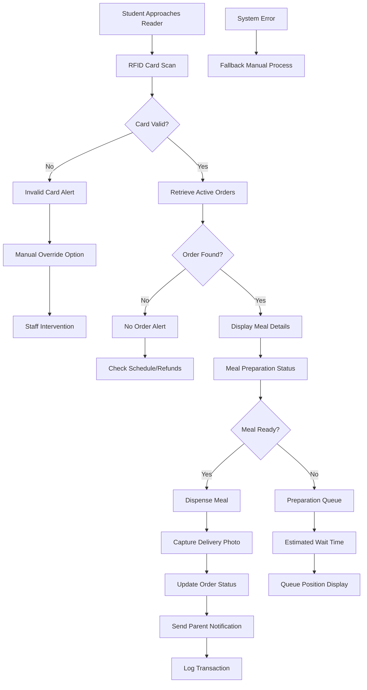
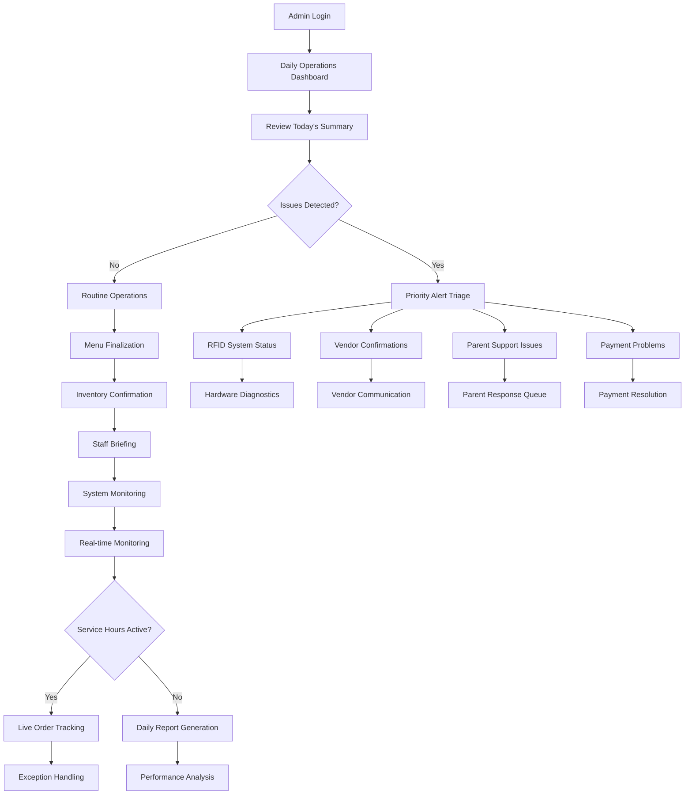

# HASIVU Platform UI/UX Specification

## Introduction

This document defines the user experience goals, information architecture, user flows, and visual design specifications for HASIVU Platform's user interface. It serves as the foundation for visual design and frontend development, ensuring a cohesive and user-centered experience that transforms school food service from a daily coordination burden into a seamless, transparent experience.

### Overall UX Goals & Principles

#### Target User Personas

**Primary: "Working Parent" - Priya Sharma Archetype**
- Demographics: Marketing Manager, mother of 8-year-old, ₹41.5L+ household income, both parents working
- Pain Points: Spends 45 minutes daily on meal coordination, frustrated with manual WhatsApp systems (3.2/5 satisfaction)
- Goals: Reduce daily stress, ensure child nutrition, maintain control over meal choices
- Tech Comfort: 92% smartphone usage, expects consumer e-commerce level experience

**Secondary: "School Administrator" - Operations Manager**
- Demographics: Managing 300+ students, responsible for vendor relationships and parent satisfaction
- Pain Points: Manual coordination overhead, compliance reporting challenges, parent complaint management
- Goals: Operational efficiency, real-time visibility, reduced administrative burden
- Tech Comfort: Desktop-focused workflows, needs comprehensive reporting capabilities

**Secondary: "Food Vendor" - Local Supplier**
- Demographics: Serving multiple schools, managing cash flow and inventory challenges
- Pain Points: Inaccurate forecasting, manual payment processing, food waste
- Goals: Automated order processing, payment efficiency, inventory optimization
- Tech Comfort: Mobile-friendly interfaces for daily operations

#### Usability Goals
- **Time Efficiency:** Reduce parent meal coordination from 45 minutes to <15 minutes daily
- **Learning Curve:** New parents complete first order within 5 minutes of onboarding
- **Reliability:** 99.9% uptime during school hours with <2 second response times
- **Transparency:** Real-time RFID delivery confirmation builds trust and eliminates uncertainty
- **Accessibility:** WCAG 2.1 AA compliance ensuring platform usability for all parents

#### Design Principles
1. **Mobile-First Efficiency** - Time-constrained parents need immediate access to essential functions
2. **Transparent Communication** - Every system action provides clear, immediate feedback (especially RFID verification)
3. **Institutional Respect** - Professional appearance suitable for premium school environments
4. **Progressive Disclosure** - Show essential information first, detailed data on-demand
5. **Contextual Intelligence** - Adapt interface based on user patterns, school schedules, and meal preferences

### Change Log

| Date | Version | Description | Author |
|------|---------|-------------|---------|
| 2025-08-02 | 1.0 | Initial UI/UX specification creation | Sally (UX Expert) |

## Information Architecture (IA)

### Site Map / Screen Inventory

```mermaid
graph TD
    A[Authentication Hub] --> B[Parent App]
    A --> C[School Admin Portal]
    A --> D[Vendor Portal]
    
    B --> B1[Home Dashboard]
    B --> B2[Menu Browse]
    B --> B3[Order Management]
    B --> B4[Child Profile]
    B --> B5[Account Settings]
    
    B1 --> B1a[Today's Orders]
    B1 --> B1b[Quick Reorder]
    B1 --> B1c[Notifications]
    B1 --> B1d[Delivery Status]
    
    B2 --> B2a[Daily Menus]
    B2 --> B2b[Weekly Planning]
    B2 --> B2c[Menu Search/Filter]
    B2 --> B2d[Meal Details]
    
    B3 --> B3a[Shopping Cart]
    B3 --> B3b[Order History]
    B3 --> B3c[Schedule Manager]
    B3 --> B3d[Payment Methods]
    
    C --> C1[Operations Dashboard]
    C --> C2[Menu Management]
    C --> C3[Order Processing]
    C --> C4[User Management]
    C --> C5[Reports & Analytics]
    
    C1 --> C1a[Daily Overview]
    C1 --> C1b[RFID Status Monitor]
    C1 --> C1c[Vendor Coordination]
    C1 --> C1d[Parent Communications]
    
    D --> D1[Order Dashboard]
    D --> D2[Inventory Management]
    D --> D3[Payment Tracking]
    D --> D4[Performance Metrics]
```

### Navigation Structure

**Primary Navigation - Parent App:**
Tab-based bottom navigation optimized for one-handed mobile use:
- Home (dashboard with today's focus)
- Menu (browsing and planning)
- Orders (management and history)
- Profile (child settings and account)

**Secondary Navigation - Parent App:**
Contextual navigation within each section using familiar mobile patterns (swipe, modal sheets, drawer navigation for filters)

**Primary Navigation - School Admin Portal:**
Sidebar navigation suitable for desktop workflows:
- Dashboard (operational overview)
- Menu Management (catalog and scheduling)
- Orders (processing and tracking)
- Users (parent and student management)
- Reports (analytics and compliance)
- Settings (school configuration)

**Primary Navigation - Vendor Portal:**
Simplified navigation focused on daily operations:
- Today's Orders (primary workflow)
- Inventory (stock management)
- Payments (financial tracking)
- Analytics (performance insights)

**Breadcrumb Strategy:**
- Parent App: Minimal breadcrumbs due to shallow navigation hierarchy
- Admin Portal: Full breadcrumb navigation for complex workflows
- Vendor Portal: Context-aware breadcrumbs for multi-step processes

## User Flows

### Parent Meal Ordering Flow

**User Goal:** Order lunch for child with minimal time investment while ensuring nutritional needs are met

**Entry Points:** Home dashboard, push notification, scheduled reminder

**Success Criteria:** Order completed in <3 minutes with payment confirmation and delivery scheduling

#### Flow Diagram

#### Edge Cases & Error Handling:
- Payment failure: Clear error message with alternative payment method suggestions
- Menu item unavailable: Automatic similar item suggestions with nutritional matching
- Delivery window full: Alternative time slots with waiting list option
- RFID card lost/forgotten: Temporary access code generation with parent notification
- Network connectivity issues: Offline order queuing with sync confirmation
- School closure/holiday: Automatic refund processing with parent notification

**Notes:** Flow optimized for habitual use - returning users see quick reorder options prominently. First-time users get contextual onboarding without blocking core functionality.

### RFID Delivery Verification Flow

**User Goal:** Confirm child received ordered meal with complete transparency and peace of mind

**Entry Points:** Automatic trigger when child approaches RFID reader, parent app notification

**Success Criteria:** Sub-2-second verification with immediate parent notification and visual confirmation

#### Flow Diagram

#### Edge Cases & Error Handling:
- RFID reader malfunction: Manual QR code backup with same workflow
- Multiple orders for same student: Clear disambiguation interface for staff
- Dietary restriction violations: Prominent warnings with override confirmation
- Photo capture failure: Text-based confirmation with manual photo option
- Parent phone offline: SMS backup notification with delivery confirmation
- Student card sharing: Security alerts with photo verification requirements

**Notes:** Critical workflow requiring 99.9% reliability. All error states maintain audit trail for parent transparency and school compliance.

### School Admin Daily Operations Flow

**User Goal:** Efficiently manage daily food service operations with real-time visibility and minimal manual intervention

**Entry Points:** Admin dashboard login, automated morning briefing, urgent alerts

**Success Criteria:** Complete daily setup in <15 minutes with ongoing monitoring requiring minimal intervention

#### Flow Diagram

#### Edge Cases & Error Handling:
- RFID system complete failure: Emergency manual verification protocol activation
- Vendor no-show: Automated parent notifications with alternative options
- Mass payment failures: Bulk resolution tools with automated retry scheduling
- Student medical emergency affecting meals: Immediate dietary alert system activation
- System overload during peak hours: Automatic load balancing with priority queuing
- Parent complaint escalation: Automated workflow routing with response time tracking

**Notes:** Dashboard designed for exception-based management - normal operations require minimal attention, problems get prominent visibility with guided resolution workflows.

## Wireframes & Mockups

**Primary Design Files:** Figma workspace with comprehensive design system and interactive prototypes
- **URL:** https://figma.com/hasivu-platform-design-system
- **Access:** Development team invited with developer handoff permissions
- **Structure:** Organized by user type (Parent, Admin, Vendor) with shared component library

### Key Screen Layouts

#### Parent App - Home Dashboard (Mobile)

**Purpose:** Provide immediate access to today's meal status and quick actions for time-constrained parents

**Key Elements:**
- **Status Card:** Today's order with delivery countdown and RFID confirmation status
- **Quick Actions:** Reorder yesterday's meal, browse today's menu, emergency contact
- **Child Profile Widget:** Current child selected with quick switcher for multiple children
- **Notification Banner:** Important updates with contextual actions
- **Bottom Navigation:** Home, Menu, Orders, Profile with badge indicators

**Interaction Notes:** 
- Pull-to-refresh for real-time updates
- Swipe gestures on status card reveal detailed information
- Haptic feedback for confirmation actions
- Voice-over support for all interactive elements

**Design File Reference:** Frame process.env.DOCS_FRONT-END-SPEC_PASSWORD_1 in Mobile Flows section

#### School Admin - Operations Dashboard (Desktop)

**Purpose:** Comprehensive operational overview with exception-based monitoring for efficient daily management

**Key Elements:**
- **KPI Overview Bar:** Daily orders, completion rate, RFID system status, parent satisfaction
- **Alert Center:** Priority issues requiring immediate attention with severity indicators
- **Real-time Activity Feed:** Live order processing, delivery confirmations, system events
- **Quick Action Panel:** Common administrative tasks with keyboard shortcuts
- **System Status Grid:** RFID readers, payment processing, vendor coordination status

**Interaction Notes:**
- Keyboard navigation support for power users
- Customizable dashboard layout with drag-and-drop widgets
- Advanced filtering and search across all data streams
- Export functionality for compliance reporting

**Design File Reference:** Frame process.env.DOCS_FRONT-END-SPEC_PASSWORD_2 in Desktop Flows section

#### Vendor Portal - Order Management (Responsive)

**Purpose:** Daily order processing with inventory tracking and payment visibility optimized for mobile and desktop use

**Key Elements:**
- **Today's Orders List:** Sortable by school, delivery time, meal type with preparation status
- **Inventory Alerts:** Low stock warnings with reorder suggestions and supplier integration
- **Payment Summary:** Daily revenue tracking with outstanding balance alerts
- **Preparation Timeline:** Visual workflow with estimated completion times
- **Communication Panel:** Direct messaging with school administrators

**Interaction Notes:**
- Batch operations for order processing efficiency
- Barcode scanning integration for inventory management
- Offline capability with synchronization indicators
- Print-friendly layouts for kitchen operations

**Design File Reference:** Frame process.env.DOCS_FRONT-END-SPEC_PASSWORD_3 in Responsive Flows section

## Component Library / Design System

**Design System Approach:** Custom design system built on proven foundations (Material Design principles) with institutional-specific adaptations and HASIVU brand identity. Prioritizes accessibility, mobile performance, and cross-platform consistency.

### Core Components

#### RFID Status Indicator

**Purpose:** Unique component providing real-time RFID verification status with clear visual feedback for all user types

**Variants:**
- Scanning (animated pulse with blue accent)
- Verified (green checkmark with success animation)  
- Failed (red warning with retry action)
- Offline (gray state with diagnostic information)

**States:**
- Default: Ready for scanning
- Active: Processing RFID data
- Success: Confirmed delivery
- Error: Requires attention
- Disabled: System maintenance

**Usage Guidelines:** 
- Always paired with textual description for accessibility
- Consistent timing animations (2-second pulse cycles)
- Color coding follows system-wide status conventions
- Never used as sole indicator - always includes fallback information

#### Meal Card Component

**Purpose:** Primary content component displaying meal information with nutritional data, pricing, and ordering actions

**Variants:**
- Catalog View: Menu browsing with quick add actions
- Cart View: Order management with quantity controls
- History View: Past orders with reorder functionality
- Featured View: Promoted meals with enhanced imagery

**States:**
- Available: Normal ordering state
- Limited: Low inventory with urgency indicators
- Unavailable: Sold out with alternative suggestions
- Dietary Alert: Restriction warnings with clear messaging
- Loading: Content fetching with skeleton animation

**Usage Guidelines:**
- Consistent card dimensions across breakpoints with responsive image scaling
- Accessibility labels include complete nutritional information
- Touch targets minimum 44px for mobile interfaces
- Hover states for desktop with additional information preview

#### Order Status Timeline

**Purpose:** Visual progress indicator showing complete order lifecycle from placement to delivery confirmation

**Variants:**
- Compact: Single-line progress for dashboard views
- Detailed: Full timeline with timestamps and descriptions
- Interactive: Expandable sections with additional context
- Historical: Past order review with performance metrics

**States:**
- Confirmed: Order received and processing
- Prepared: Kitchen completion with quality confirmation
- Ready: Available for pickup with location details
- Delivered: RFID confirmed with photo evidence
- Exception: Issues requiring resolution with action steps

**Usage Guidelines:**
- Progressive disclosure - show current status prominently with expandable details
- Real-time updates with smooth transition animations
- Clear visual hierarchy distinguishing completed vs. pending steps
- Integration with notification system for status change alerts

## Branding & Style Guide

### Visual Identity

**Brand Guidelines:** HASIVU Brand System v2.0 - Professional institutional identity balancing trust, innovation, and child-focused care
- **Brand Personality:** Reliable, transparent, caring, innovative, professional
- **Visual Approach:** Clean, modern interface with warm accent colors and institutional credibility
- **Tone:** Friendly but professional, informative without overwhelming, supportive during problems

### Color Palette

| Color Type | Hex Code | Usage |
|------------|----------|-------|
| Primary | #2E5BBA | Primary actions, navigation, institutional branding |
| Secondary | #28A745 | Success states, health/nutrition indicators, delivery confirmations |
| Accent | #FF8C00 | Attention-grabbing elements, urgent notifications, call-to-action highlights |
| Success | #28A745 | Positive feedback, confirmations, RFID verification success |
| Warning | #FFC107 | Cautions, important notices, inventory alerts, schedule conflicts |
| Error | #DC3545 | Errors, destructive actions, RFID failures, payment problems |
| Neutral | #6C757D, #ADB5BD, #DEE2E6, #F8F9FA | Text hierarchy, borders, backgrounds, disabled states |

### Typography

#### Font Families
- **Primary:** Inter (UI text, high legibility, web font optimization)
- **Secondary:** Poppins (headings, brand elements, friendly personality)
- **Monospace:** JetBrains Mono (codes, technical data, timestamps)

#### Type Scale

| Element | Size | Weight | Line Height |
|---------|------|--------|-------------|
| H1 | 32px | 600 | 1.25 |
| H2 | 24px | 600 | 1.3 |
| H3 | 20px | 500 | 1.4 |
| Body | 16px | 400 | 1.5 |
| Small | 14px | 400 | 1.4 |
| Caption | 12px | 500 | 1.3 |

### Iconography

**Icon Library:** Heroicons v2 with custom HASIVU-specific icons for unique features (RFID scanning, meal categories, school-specific functions)

**Usage Guidelines:** 
- Consistent 24px base size with scaling for different contexts
- Outlined style for navigation, filled style for status indicators
- Custom animated icons for RFID scanning and delivery confirmation
- Accessibility - all icons paired with descriptive labels

### Spacing & Layout

**Grid System:** 4px base unit with 8px, 16px, 24px, 32px, 48px standard spacing increments

**Spacing Scale:** 
- Micro: 4px (icon spacing, tight layouts)
- Small: 8px (component internal spacing)
- Medium: 16px (section spacing, card padding)
- Large: 24px (major section breaks)
- XL: 32px (page-level spacing)
- XXL: 48px (hero sections, major breaks)

## Accessibility Requirements

### Compliance Target

**Standard:** WCAG 2.1 AA compliance with enhanced focus on mobile accessibility and parent use cases during stressful meal coordination scenarios

### Key Requirements

**Visual:**
- Color contrast ratios: 4.5:1 minimum for normal text, 3:1 for large text, 7:1 for critical status indicators
- Focus indicators: 2px solid outline with high contrast, visible on all interactive elements
- Text sizing: Support for 200% zoom without horizontal scrolling, scalable typography system

**Interaction:**
- Keyboard navigation: Complete app functionality available via keyboard with logical tab order
- Screen reader support: Comprehensive ARIA labels, live regions for status updates, semantic HTML structure
- Touch targets: Minimum 44px × 44px for all interactive elements with adequate spacing

**Content:**
- Alternative text: Descriptive alt text for all images including meal photos and RFID status indicators
- Heading structure: Logical H1-H6 hierarchy supporting screen reader navigation
- Form labels: Clear, descriptive labels for all form inputs with error messaging integration

### Testing Strategy

**Automated Testing:** Integration with axe-core accessibility testing in CI/CD pipeline with zero-violation requirements

**Manual Testing:** 
- Monthly testing with screen readers (NVDA, JAWS, VoiceOver)
- Quarterly testing with keyboard-only navigation
- User testing with parents who have disabilities
- Color blindness simulation testing for all critical workflows

**Documentation:** Accessibility checklist for all new features with developer guidance and QA requirements

## Responsiveness Strategy

### Breakpoints

| Breakpoint | Min Width | Max Width | Target Devices |
|------------|-----------|-----------|----------------|
| Mobile | 320px | 767px | Phones, primary parent interface |
| Tablet | 768px | 1023px | Tablets, occasional parent use, vendor mobile |
| Desktop | 1024px | 1439px | School admin workstations, vendor management |
| Wide | 1440px | - | Large displays, detailed analytics, multi-monitor setups |

### Adaptation Patterns

**Layout Changes:** 
- Mobile: Single-column layouts with full-width cards and prominent CTAs
- Tablet: Two-column layouts with sidebar navigation and split views
- Desktop: Multi-column layouts with comprehensive sidebars and data tables
- Wide: Dashboard layouts with multiple data visualization panels

**Navigation Changes:**
- Mobile: Bottom tab navigation with hamburger menu for secondary options
- Tablet: Slide-out sidebar navigation with tabbed secondary navigation
- Desktop: Persistent sidebar navigation with breadcrumb and contextual toolbars
- Wide: Expanded sidebar with quick access panels and multi-level navigation

**Content Priority:**
- Mobile: Essential information only with progressive disclosure patterns
- Tablet: Balanced information density with expandable sections
- Desktop: Comprehensive information display with advanced filtering
- Wide: Maximum information density with multiple simultaneous views

**Interaction Changes:**
- Mobile: Touch-optimized with swipe gestures and haptic feedback
- Tablet: Mixed touch and precision interactions with hover states
- Desktop: Mouse and keyboard optimized with advanced shortcuts
- Wide: Power-user features with drag-and-drop and multi-selection capabilities

## Animation & Micro-interactions

### Motion Principles

**Purposeful Motion:** Every animation serves a functional purpose - providing feedback, guiding attention, or maintaining context during transitions. No decorative animations that impact performance or accessibility.

**Duration Standards:** 
- Micro-interactions: 150-300ms for immediate feedback
- Screen transitions: 300-500ms for spatial context
- Loading states: Continuous with progress indication
- Status changes: 200ms with clear before/after states

**Easing Functions:**
- Ease-out: Default for most interactions (natural deceleration)
- Ease-in-out: Screen transitions and large movements
- Linear: Progress indicators and technical status updates
- Custom: RFID scanning pulse (smooth continuous loop)

### Key Animations

- **RFID Scanning Pulse:** Continuous 2-second pulse animation with blue accent (Duration: 2000ms, Easing: cubic-bezier(0.4, 0, 0.6, 1))
- **Order Status Transition:** Smooth progression with check mark animation (Duration: 400ms, Easing: ease-out)
- **Meal Card Flip:** Reveal nutritional information with 3D transform (Duration: 300ms, Easing: ease-in-out)
- **Loading Skeleton:** Content placeholder with shimmer effect (Duration: 1500ms, Easing: linear)
- **Success Confirmation:** Check mark draw animation with scale bounce (Duration: 600ms, Easing: ease-out)
- **Error Shake:** Subtle horizontal shake for failed actions (Duration: 300ms, Easing: ease-in-out)
- **Pull-to-Refresh:** Elastic bounce with progress indication (Duration: variable, Easing: ease-out)
- **Navigation Transition:** Slide transitions maintaining spatial context (Duration: 250ms, Easing: ease-out)

## Performance Considerations

### Performance Goals
- **Page Load:** <2 seconds initial load, <1 second subsequent navigation
- **Interaction Response:** <100ms for immediate feedback, <300ms for complex operations
- **Animation FPS:** Consistent 60fps for all animations with graceful degradation on older devices

### Design Strategies

**Image Optimization:**
- WebP format with JPEG fallbacks for meal photography
- Progressive loading with blur-up technique for large images
- Responsive image sizes with srcset optimization
- Lazy loading for off-screen content with intersection observer

**Component Performance:**
- Virtual scrolling for large lists (order history, menu catalogs)
- Memoization of expensive calculations (nutritional summaries, pricing)
- Code splitting by user role and feature usage patterns
- Optimistic UI updates with rollback capabilities for network failures

**Network Optimization:**
- Offline-first architecture with intelligent caching strategies
- Background sync for non-critical data updates
- Compression and minification of all assets
- CDN distribution for static assets with regional optimization

## Next Steps

### Immediate Actions

1. **Stakeholder Review Session** - Present complete UI/UX specification to project stakeholders for validation and feedback collection
2. **Figma Design System Setup** - Create comprehensive component library with all specified elements and interaction states
3. **Accessibility Audit Planning** - Schedule initial accessibility review with specialized consultant to validate compliance approach
4. **Technical Feasibility Review** - Collaborate with development team to confirm technical implementation feasibility for all specified features
5. **User Testing Protocol** - Design user testing methodology for key workflows, particularly RFID verification and meal ordering flows
6. **Performance Budget Definition** - Establish specific performance metrics and monitoring strategies with development team
7. **Design Token System** - Create design token system for consistent cross-platform implementation

### Design Handoff Checklist

- [x] All user flows documented with edge cases and error states
- [x] Component inventory complete with variants and states
- [x] Accessibility requirements defined with testing strategy
- [x] Responsive strategy clear with breakpoint specifications
- [x] Brand guidelines incorporated with comprehensive style guide
- [x] Performance goals established with optimization strategies
- [ ] Interactive prototypes created for complex workflows
- [ ] Design system implemented in Figma with developer handoff
- [ ] Animation specifications documented with timing and easing
- [ ] Icon library finalized with custom HASIVU elements
- [ ] User testing conducted on key workflows
- [ ] Technical review completed with development team

---

*Generated using BMad Method - UX Expert Agent*
*Document Version: 1.0*
*Created: August 2, 2025*

## Technical Handoff Notes

**Ready for Development:** This specification provides comprehensive guidance for frontend implementation with React Native (mobile) and React (web) applications.

**Critical Design Decisions:**
- RFID verification UI patterns require custom component development
- Multi-stakeholder navigation requires careful role-based interface adaptation
- Mobile-first approach with progressive enhancement for larger screens
- Accessibility compliance built into every component specification

**Next Phase:** Ready for technical architecture design and component library implementation.